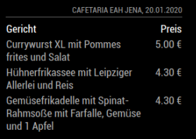
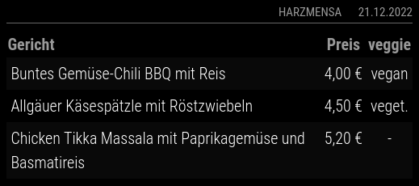

# MMM-Canteen

**MMM-Canteen** is a module for the [MagicMirror²](https://github.com/MichMich/MagicMirror) project.

It shows the the menu including the prices of canteens from universities in Germany and Switzerland (based on [openmensa.org](https://openmensa.org)).

## Screenshots

### Example of a canteen in Leipzig



### Example of a canteen in Halle with veggie information



## Installation

Just clone the module into your modules folder of your MagicMirror² and execute `npm install --omit=dev` in the module’s directory:

```bash
git clone https://github.com/k-0/MMM-Canteen
cd MMM-Canteen
npm install --omit=dev
```

## Update

Go to the module’s folder inside MagicMirror modules folder and pull the latest version from GitHub and install:

```bash
git pull
npm install --omit=dev
```

## Using the module

### Configuration

To use this module, add it to the `config.js` file. Here is an example:

```javascript
{
  module: "MMM-Canteen",
  position: "bottom_center",
  config: {
    canteenName: "Mensa am Park",
    canteen: 63,
    status: "employees",
    switchTime: "15:00",
    showVeggieColumn: true
  }
},
```

It is also possible to add multiple instances. Here is a simple example:

```javascript
{
  module: "MMM-Canteen",
  position: "right",
  config: {
    canteenName: "Mensa 1",
    canteen: 240
  }
},
{
  module: "MMM-Canteen",
  position: "right",
  config: {
    canteenName: "Mensa 2",
    canteen: 241,
  }
},
```

### Configuration options

<!-- prettier-ignore-start -->
| Option             | Description                   | Type    | Default                                  |
| ------------------ | ----------------------------- | ------- | ---------------------------------------- |
| `updateInterval`   | Interval to update data       | Integer | `10 * 60 * 1000` (= 10 minutes)          |
| `canteen`          | ID from the openmensa.org url | Integer | `63` (= Mensa am Park, Uni Leipzig)      |
| `status`           | Your status  <br> **Possible values:** `"employees"`, `"students"`, `"pupils"`, `"others"` | String | `"employees"` |
| `truncate`         | Truncate more than x letters  | Integer | `100`                                    |
| `canteenName`      | Name of the canteen           | String  | `"Kantine"`                              |
| `switchTime`       | Shows the menu from next day, if switchTime < now | Timestamp (HH:mm) | `"16:00"`  |
| `animationSpeed`   | Speed of the update animation (in milliseconds).<br>If you don't want that the module blinks during an update, set the value to `0`. <br> **Possible values:** `0` - `5000` | Integer | `500` |
| `showVeggieColumn` | Show Veggie Column or not     | Boolean | `true`                                   |
| `debug`            | Debugging                     | Boolean | `false`                                  |
<!-- prettier-ignore-end -->

## Special Thanks

- [Michael Teeuw](https://github.com/MichMich) for creating the inspiring project [MagicMirror²](https://github.com/MichMich/MagicMirror).
- The great community of MagicMirror² that keeps this impressive project alive and permanently improves it.
- All contributors for finding and fixing errors in this module.

## Contributing

If you find any problems, bugs or have questions, please [open a GitHub issue](https://github.com/k-0/MMM-Canteen/issues) in this repository.

Pull requests are of course also very welcome 🙂
